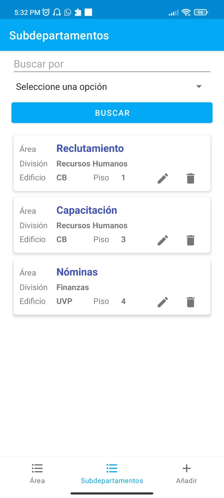
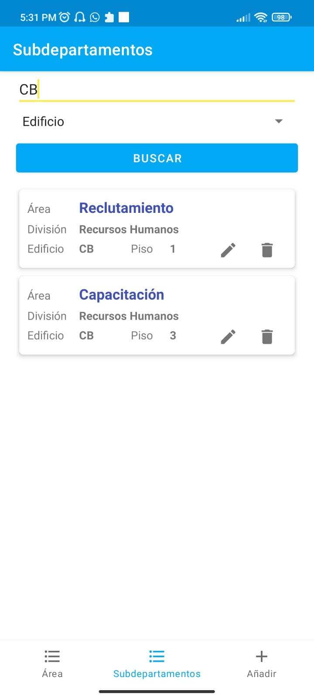
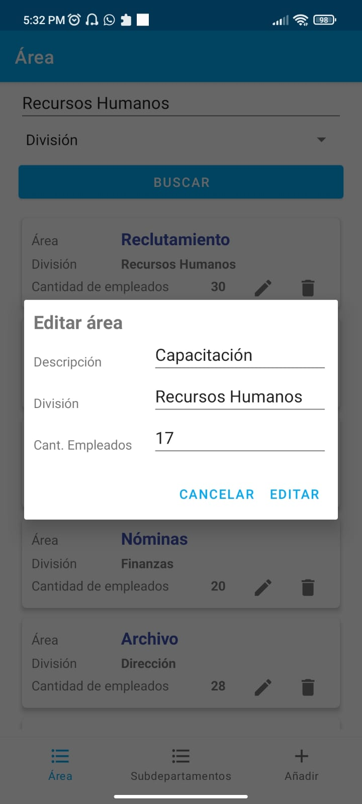

# LADM_U3_Practica1_SQLite

Daniel Alejandro Calderón Virgen
No Crtl 18401090
Ing en Sistemas Computacionales
Tecnológico Nacional de México, Campus Tepic

LABORATORIO DE APLICACIONES PARA DISPOSITIVOS MÓVILES
MTI SERGIO BENIGNO CASTILLO VALTIERRA

## Aplicación para ubicar subdepartamentos

Insertar áreas y subdepartamentos

Ver áreas

Ver áreas por busqueda

Ver subdepartamentos

Ver subdepartamentos por busqueda

Actualizar
